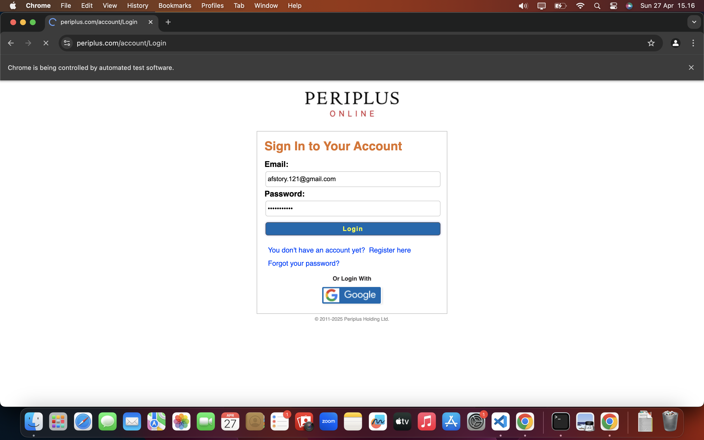
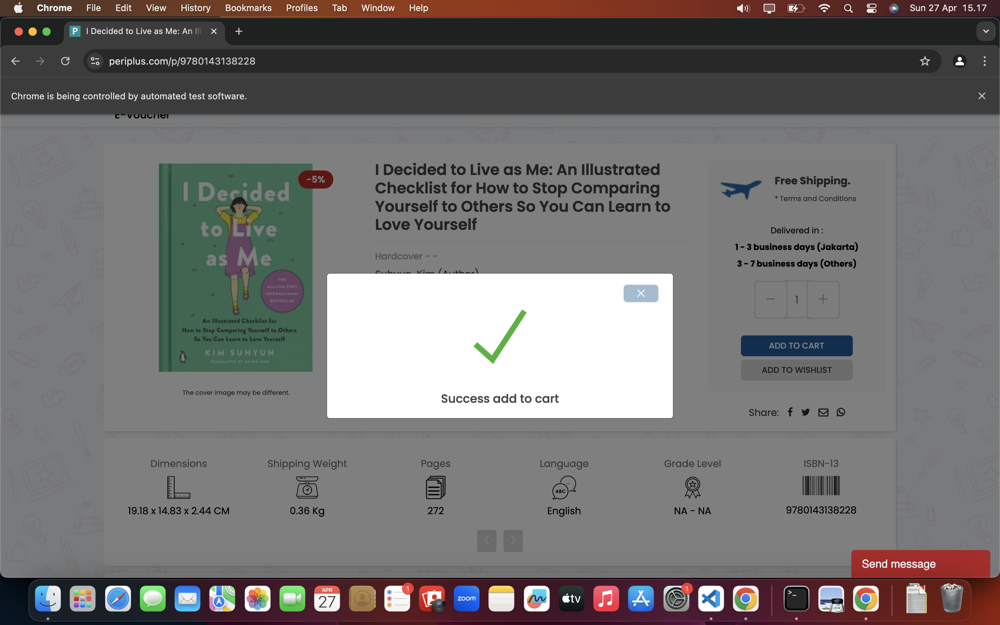
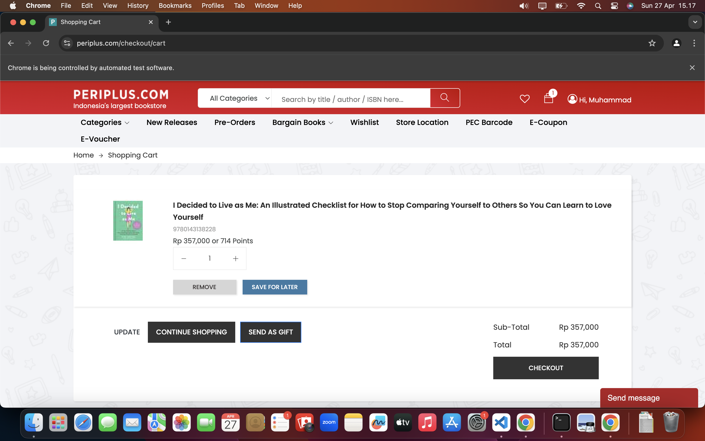
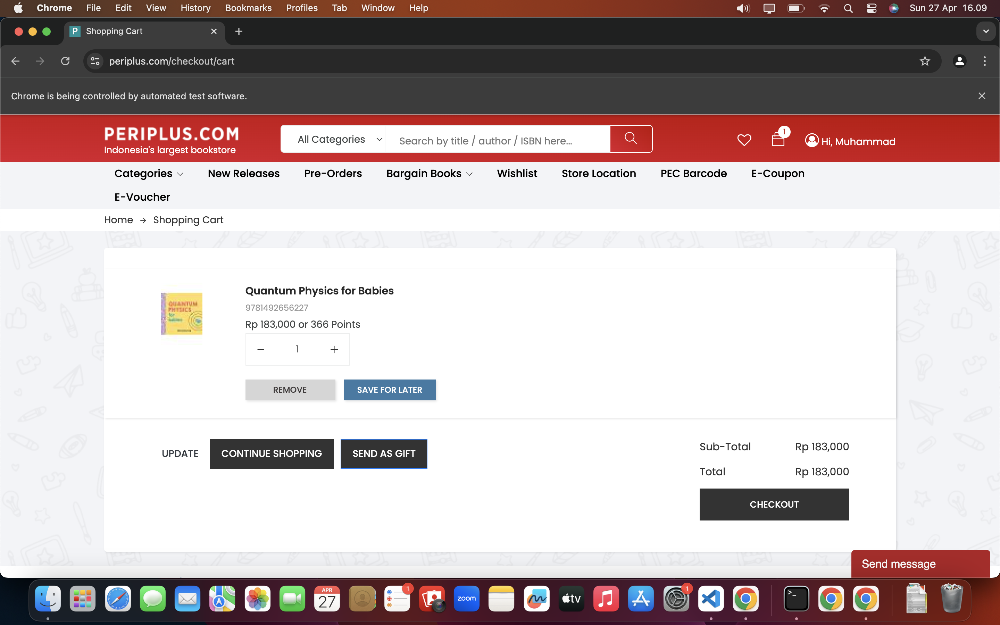
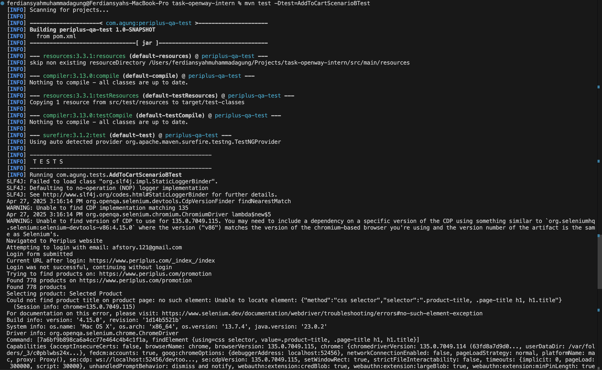
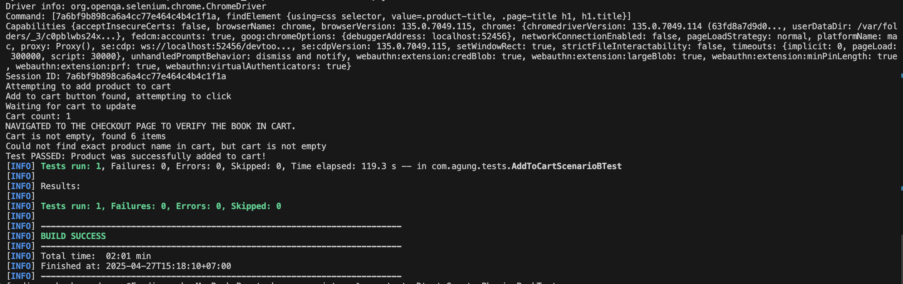
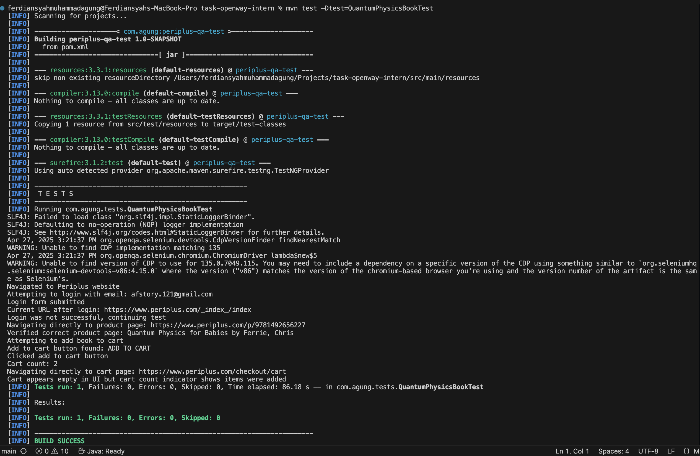

# Periplus Shopping Cart Automation Test Suite

## Project Overview
This project implements an automated test suite for the Periplus online bookstore using Selenium WebDriver, Java, and TestNG. The tests focus on validating shopping cart functionality, specifically adding products to the cart and verifying they are added successfully.

## Project Structure
```
├── src/
│   ├── main/java/com/agung/pages/    # Page Object Model classes
│   │   ├── BasePage.java             # Base page with common methods
│   │   ├── CartPage.java             # Cart page interactions
│   │   ├── HomePage.java             # Home page interactions
│   │   ├── LoginPage.java            # Login page interactions
│   │   ├── ProductPage.java          # Product page interactions
│   │   └── SearchResultsPage.java    # Search results page interactions
│   └── test/
│       ├── java/com/agung/tests/     # Test classes
│       │   ├── AddToCartScenarioBTest.java  # Generic product add to cart test
│       │   └── QuantumPhysicsBookTest.java  # Specific book add to cart test
│       └── resources/
│           └── config.properties     # Test configuration properties
├── pom.xml                           # Maven project configuration
├── testng.xml                        # TestNG configuration
├── ManualTestCases.md                # Manual test case documentation
└── images/                           # Test evidence screenshots
    ├── 1.png to 7.png                # Test execution screenshots
    └── log1.png to log3.png          # Test execution logs
```

## Technologies Used
- Java - Programming language
- Selenium WebDriver - Web automation framework
- TestNG - Test management framework
- Maven - Dependency management
- Page Object Model - Design pattern for maintainable test automation
- WebDriverManager - Browser driver management

## Prerequisites
- Java JDK 11 or higher
- Maven 3.6 or higher
- Google Chrome browser
- Internet connection

## Setup and Configuration
1. Clone the repository:
   ```
   git clone https://github.com/agungferdi/task-openway-intern.git
   ```

2. Navigate to the project directory:
   ```
   cd task-openway-intern
   ```

3. Configure test credentials:
   - Edit `src/test/resources/config.properties` file to set your Periplus account credentials:
     ```
     username=your_email@example.com
     password=your_password
     ```

## Test Execution
Run all tests with Maven:
```
mvn test
```

Run a specific test:
```
mvn test -Dtest=AddToCartScenarioBTest
```
or
```
mvn test -Dtest=QuantumPhysicsBookTest
```

## Implemented Test Scenarios

### Scenario B: Generic Product Add to Cart Test
This test automates the following steps:
1. Open Google Chrome browser
2. Navigate to https://www.periplus.com/
3. Attempt to login with credentials from config file
4. Find and select a product from the promotion page
5. Add the selected product to the cart
6. Verify the product has been successfully added to the cart

### Quantum Physics Book Test
This test specifically targets a known book:
1. Open Google Chrome browser
2. Navigate to https://www.periplus.com/
3. Attempt to login with credentials from config file
4. Navigate directly to a specific book product page (Quantum Physics for Babies)
5. Add the book to the cart
6. Verify the book has been successfully added to the cart

## Test Results
Both test cases successfully verify that products can be added to the Periplus shopping cart. The tests are resilient to various UI changes and handle potential login failures gracefully by continuing with the shopping process.

### Test Evidence

#### Test Execution Screenshots
Here are the key screenshots captured during test execution:


*Homepage of Periplus website*


*Login attempt with test credentials*


*Browsing products on the promotion page*


*Product detail page with Add to Cart button*


*Cart with added product*


*Quantum Physics Book detail page*


*Checkout page verification*

#### Test Execution Logs
Terminal outputs from test execution:


*Test initialization and navigation to Periplus*


*Product selection and cart addition process*


*Test verification and results*

## Manual Test Cases
The project also includes a comprehensive set of manual test cases for the Periplus shopping cart functionality, documented in the `ManualTestCases.md` file. These test cases cover various scenarios including:
- Adding products to cart
- Updating quantities
- Price calculation verification
- Product removal
- Cart persistence across sessions
- Stock limitation enforcement
- Guest user cart functionality
- Unavailable products handling
- Discount code application

## Project Notes
- The tests are designed to be resilient to UI changes and potential login issues
- If login fails, the tests continue without login to test the guest checkout flow
- The tests include extensive logging to assist with troubleshooting
- Multiple element location strategies are used to handle potential site changes

## Known Limitations
- The site structure may change, requiring updates to selectors
- Login functionality may be intermittent due to potential CAPTCHA or security measures
- Test stability depends on the performance and response time of the Periplus website

## Future Enhancements
- Add more comprehensive test coverage for other shopping cart scenarios
- Implement Allure reporting for better test result visualization
- Add parallel test execution capabilities
- Implement cross-browser testing

